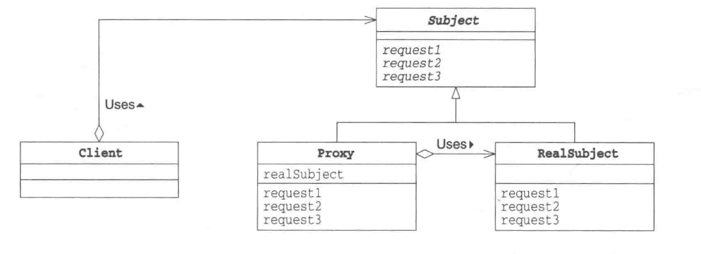
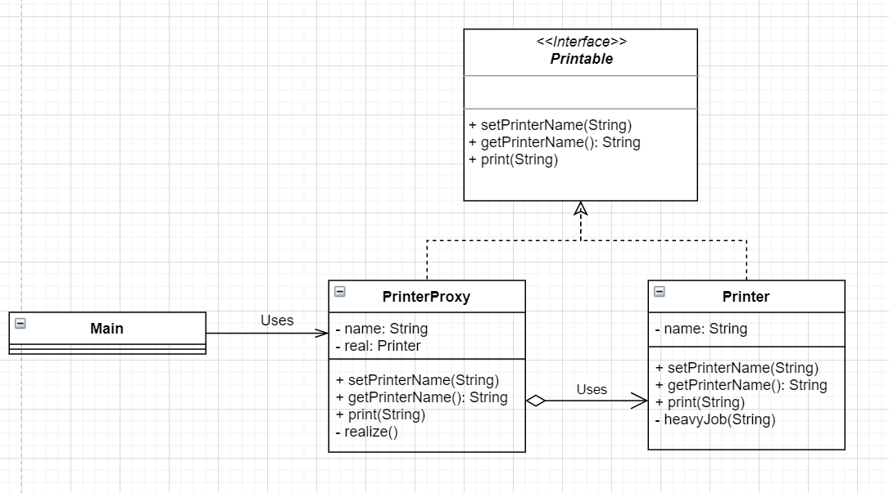
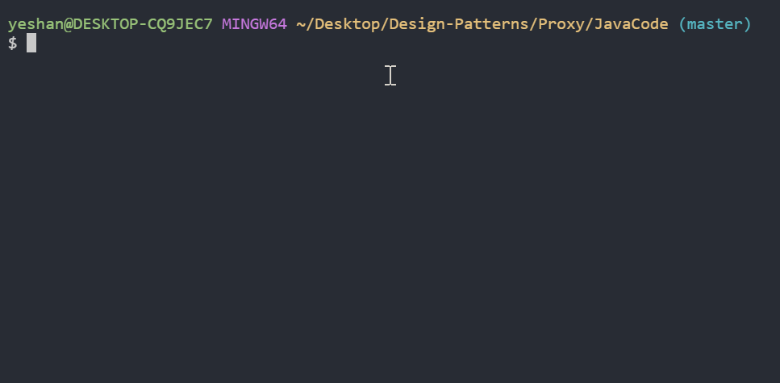

# 代理模式



```python
# 以下单线程安全，虚拟代理模式：真正需要实例时，生成和初始化实例
import time
from typing import Any

# 代理与被代理对象的公共接口，Subject
class Printable(object):
    def setPrinterName(self, name: str) -> None:
        pass

    def getPrinterName(self) -> str:  # 获取打印机名字
        pass

    def printf(self, string: str):  # 打印文字
        pass

# RealSubject
class Printer(Printable):
    def __init__(self, name: str) -> None:
        self._name: str = name
        self._heavyJob("正在生成 Printer 的实例" + "(" + name + ")")

    def _heavyJob(self, msg: str) -> None:  # 繁忙态
        print(msg, end='')
        for _ in range(5):
            time.sleep(1)
            print('.', end='')  # 伪装实例创建的进度
        print("结束")

    def setPrinterName(self, name: str) -> None:
        self._name = name

    def getPrinterName(self) -> str:
        return self._name

    def printf(self, string: str) -> None:
        print("=== 使用打印机：" + self._name + " 进行如下打印  ===")
        print(string)

# ProxySubject
class PrinterProxy(Printable):
    def __init__(self, name: str) -> None:
        self._name: str = name
        self._real: Any = None # 被代理的打印机

    def setPrinterName(self, name: str) -> None:
        if self._real != None:  # 打印机已不再繁忙（实例创建完毕）
            self._real.setPrinterName(name)
        self._name = name

    def getPrinterName(self) -> str:
        return self._name

    def printf(self, string: str) -> None:
        self._realize()
        self._real.printf(string)  # 让被代理的打印机做本次打印工作

    def _realize(self) -> None:
        if self._real == None:  # 被代理的打印机它来了
            self._real = Printer(self._name)

# client
def main():
    p: Printable = PrinterProxy("代理打印机")
    print("现在使用的是：" + p.getPrinterName())
    p.setPrinterName("原工作繁忙，现在空闲的打印机")
    print("现在使用的是：" + p.getPrinterName())

    p.printf("你好")

if __name__ == '__main__':
    main()
```



JavaCode_result

